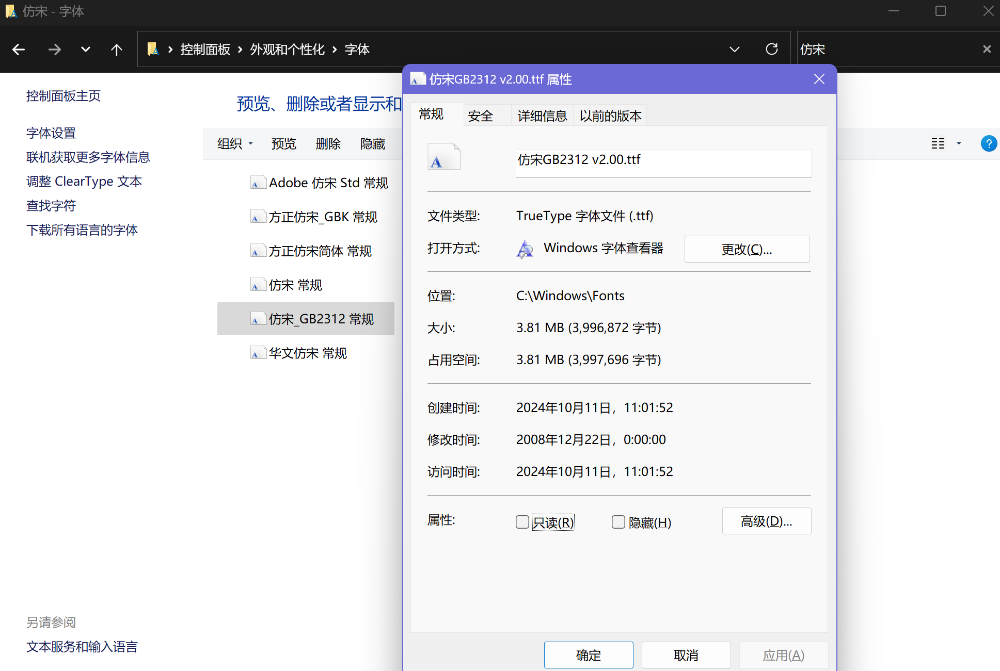
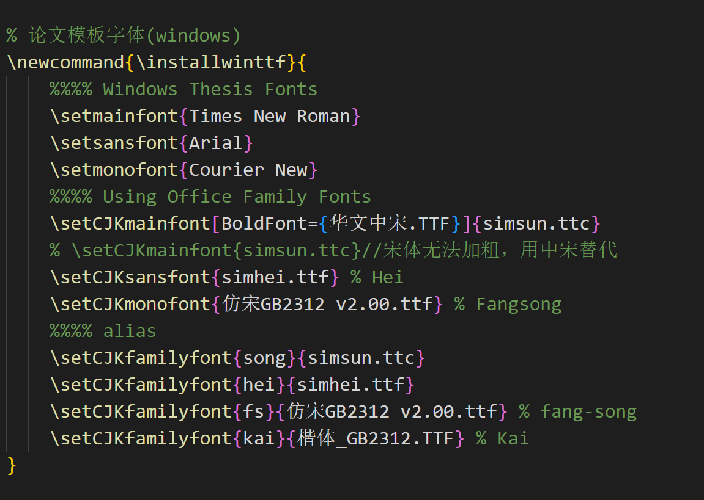

# 更新记录
+ 2024年10月11日：由于之前存在几个模板仓库，大家比较混乱，有的不支持专硕等，还有就是存在目录开始空白页不显示页眉页脚的问题（TomHeaven模板修正了，但是目录页好像不显示，而且这个模板专硕的话还要手动修改），这里统一修正一下，顺便介绍一下关键用法提高效率。

# 已测试配置
1. win11 + vscode + texlive2024
1. win11（wsl2+ubuntu20.04）+ vscode + texlive2019

# 用法介绍
## 编译
主体文件`mainpaper.tex`，在vscode中编译即可，编译链：*"xelatex -> biber -> xelatex*2"*（由于参考文献若用biblatex生成，故使用biber选项，当然也可以不用，biber与bibtex区别自行了解）
## 不同版本的论文
**方括号里面参数：**
|                                                                                                             |                                                                                                       |
| ----------------------------------------------------------------------------------------------------------- | ----------------------------------------------------------------------------------------------------- |
| 硕士/博士论文                                                                                               | master/doctor                                                                                         |
| 专硕                                                                                                        | prof                                                                                                  |
| 双面打印                                                                                                    | twoside                                                                                               |
| 参考文献若用biblatex生成，相应编译链变为：xelatex -> biber -> xelatex*2，否则xelatex -> bibtex -> xelatex*2 | biber                                                                                                 |
| 字体选项                                                                                                    | winttf(windows下面的字体名字)，ttf(ubuntu下面的字体名字)，otf等（这些是师兄师姐们推荐打印好看的字体） |
| 盲评                                                                                                        | anon                                                                                                  |
| 个人成果的文献若和参考文献一样是导出的bib，不是手动填写则使用                                               | resumebib                                                                                             |


通过主`mainpaper.tex`文件开头语句控制,如专硕明评双面打印标准字体：
```latex
\documentclass[master,twoside,biber,prof,ttf]{nudtpaper}
```


# 关于字体（很多问题出在这里）
1. 学校word模板中的字体有：
+ 仿宋_GB2312
+ Times New Roman
+ 黑体
+ 宋体（latex模板中宋体加粗用华文中宋代替）
+ 楷体_GB2312
+ Arial

2. windows下字体名可能略有出入，查找字体属性，把后缀名补齐，例如：仿宋GB2312 v2.00.ttf

在nudtpaper.cls文件下


# 编译问题
1. XeLaTeX 编译卡时间，一般就是因为找字体时间太长(还有就是win下面太慢了，我在wsl下编译实测速度提升3倍)。   
可在编译前刷新字体缓存：fc-cache -fv
1. 出现字形不可获得的警告信息，一般是因为latex公式的字体缩放不到期望的大小，会用最相近的大小代替，可忽略。


# vscode中配置
```json
    /****latex配置****/
    // 设置是否自动编译
    "latex-workshop.latex.autoBuild.run": "never",
    //右键菜单
    "latex-workshop.showContextMenu": true,
    //从使用的包中自动补全命令和环境
    "latex-workshop.intellisense.package.enabled": true,
    //编译出错时设置是否弹出气泡设置
    "latex-workshop.message.error.show": false,
    "latex-workshop.message.warning.show": false,
    // 编译工具和命令
    "latex-workshop.latex.tools": [
        {
            "name": "xelatex",
            "command": "xelatex",
            "args": [
                "-synctex=1",
                "-interaction=nonstopmode",
                "-file-line-error",
                "%DOCFILE%"
            ]
        },
        {
            "name": "xelatexNopdf",
            "command": "xelatex",
            "args": [
                "-no-pdf",
                "-interaction=nonstopmode",
                "-file-line-error",
                "%DOCFILE%"
            ]
        },
        {
            "name": "pdflatex",
            "command": "pdflatex",
            "args": [
                "-synctex=1",
                "-interaction=nonstopmode",
                "-file-line-error",
                "%DOCFILE%"
            ]
        },
        {
            "name": "latexmk",
            "command": "latexmk",
            "args": [
                "-synctex=1",
                "-interaction=nonstopmode",
                "-file-line-error",
                "-pdf",
                "-outdir=%OUTDIR%",
                "%DOCFILE%"
            ]
        },
        {
            "name": "bibtex",
            "command": "bibtex",
            "args": [
                "%DOCFILE%"
            ]
        },
        {
            "name": "biber",
            "command": "biber",
            "args": [
                "%DOCFILE%"
            ]
        }
    ],
    // 用于配置编译链
    "latex-workshop.latex.recipes": [
        {
            "name": "XeLaTeX",
            "tools": [
                "xelatex"
            ]
        },
        {
            "name": "PDFLaTeX",
            "tools": [
                "pdflatex"
            ]
        },
        {
            "name": "BibTeX",
            "tools": [
                "bibtex"
            ]
        },
        {
            "name": "LaTeXmk",
            "tools": [
                "latexmk"
            ]
        },
        {
            "name": "大论文：xelatex -> biber -> xelatex*2",
            "tools": [
                "xelatexNopdf",
                "biber",
                "xelatexNopdf",
                "xelatex"
            ]
        },
        {
            "name": "xelatex -> bibtex -> xelatex*2",
            "tools": [
                "xelatex",
                "bibtex",
                "xelatex",
                "xelatex"
            ]
        },
        {
            "name": "pdflatex -> bibtex -> pdflatex*2",
            "tools": [
                "pdflatex",
                "bibtex",
                "pdflatex",
                "pdflatex"
            ]
        }
    ],
    //文件清理。此属性必须是字符串数组
    "latex-workshop.latex.clean.fileTypes": [
        "*.aux",
        "*.bbl",
        "*.blg",
        "*.idx",
        "*.ind",
        "*.lof",
        "*.lot",
        "*.out",
        "*.toc",
        "*.acn",
        "*.acr",
        "*.alg",
        "*.glg",
        "*.glo",
        "*.gls",
        "*.ist",
        "*.fls",
        "*.log",
        "*.fdb_latexmk"
    ],
    //设置为onFaild 在构建失败后清除辅助文件
    "latex-workshop.latex.autoClean.run": "onFailed",
    // 使用上次的recipe编译组合
    "latex-workshop.latex.recipe.default": "大论文：xelatex -> biber -> xelatex*2",
    // 用于反向同步的内部查看器的键绑定。ctrl/cmd +点击(默认)或双击
    "latex-workshop.view.pdf.internal.synctex.keybinding": "double-click",
    /****end latex****/
    "remote.SSH.remotePlatform": {
        "192.168.0.48": "linux",
        "192.168.0.203": "linux",
        "fengyun1": "linux",
        "fengyun2": "linux",
        "fengyun3": "linux",
        "fengyun4": "linux",
        "实验室服务器": "linux",
        "fy1": "linux",
        "fy2": "linux",
        "fy3": "linux",
        "fy4": "linux",
        "fy5": "linux",
        "amov": "linux",
        "实验室服务器2": "linux",
        "实验室服务器1": "linux"
    },
    "cmake.configureOnOpen": true,
    "git.enableSmartCommit": true,
    "git.confirmSync": false,
    "workbench.editorAssociations": {
        "*.obj": "default",
        "*.pdf": "latex-workshop-pdf-hook"
    },
    "cmake.showOptionsMovedNotification": false,
    "grunt.autoDetect": "on",
    "cmake.pinnedCommands": [
        "cmake.configure"
    ],
    "editor.fontSize": 16,
    "bitoAI.codeCompletion.enableAutoCompletion": true,
    "bitoAI.codeCompletion.enableCommentToCode": true,
    "editor.inlineSuggest.showToolbar": "onHover",
    "workbench.colorTheme": "Default Dark+",
    "markdown-preview-enhanced.codeBlockTheme": "auto.css",
    "markdown-preview-enhanced.previewTheme": "github-dark.css",
    "python.createEnvironment.trigger": "off",
    "git.autofetch": true,
    "Codegeex.SidebarUI.LanguagePreference": "中文",
    "Codegeex.CompletionModel": "CodeGeeX Pro[Beta]",
    "Codegeex.Chat.LanguagePreference": "中文",
    "Codegeex.Local": {
        "apiURL": "",
        "useChatGLM": true,
        "chatGLM": {
            "apiKey": "",
            "model": ""
        },
        "chat": {
            "useDefaultSystemPrompt": true,
            "systemPrompt": "",
            "temperature": 0.2,
            "top_p": 0.95,
            "max_tokens": 1024,
            "presence_penalty": 1
        },
        "completions": {
            "useDefaultSystemPrompt": true,
            "systemPrompt": "",
            "temperature": 0.2,
            "top_p": 0.95,
            "max_tokens": 64,
            "presence_penalty": 1
        }
    },
    "Codegeex.DisabledFor": {
        "latex": true,
        "markdown": true
    },
    "workbench.iconTheme": "vscode-icons",
    "Codegeex.CommitMessageStyle": "Default",
    "Codegeex.License": "",
    "bitoAI.appearance.fontSize (Match with IDE Font)": false
    //latex配置结束//
```

# 致谢
主体模版修改自前辈们的工作，解决了一些配置问题：   
+ https://github.com/liubenyuan/nudtpaper
+ https://github.com/TomHeaven/nudt_thesis.git
